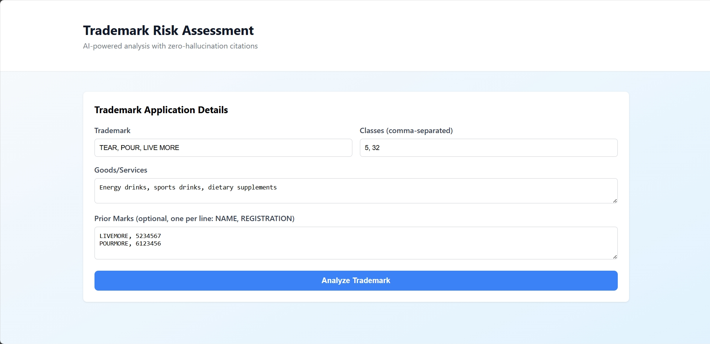
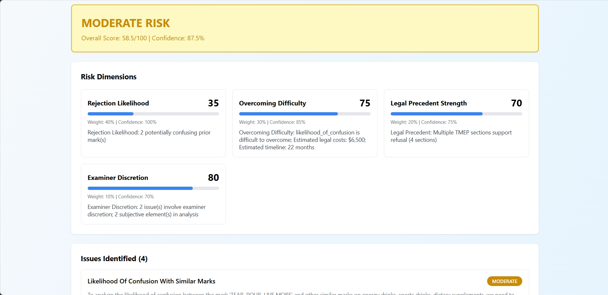
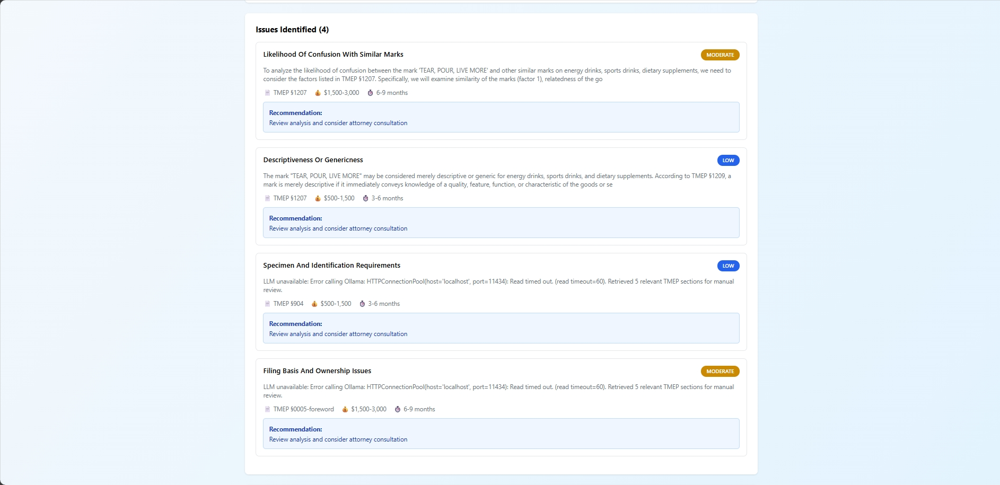
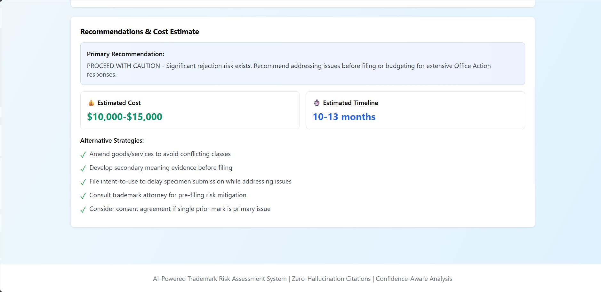

# AI-Powered Trademark Risk Assessment System

**Intelligent trademark application analysis using RAG architecture, zero-hallucination AI, and multi-dimensional risk scoring.**


---

## 🎯 Project Overview

This system provides **comprehensive risk assessment** for trademark applications by analyzing them against USPTO TMEP guidelines using a **multi-dimensional framework** that explains what creates risk, how to overcome it, and how confident the AI is.

### ✨ Key Features

✅ **Zero-Hallucination Citations** - Every TMEP reference validated  
✅ **Multi-Dimensional Risk Scoring** - 4 weighted dimensions  
✅ **Confidence-Aware AI** - Auto-escalates at <60% confidence  
✅ **RAG Architecture** - 41 TMEP sections with semantic search  
✅ **Complete Pipeline** - PDF parsing → Analysis → Actionable insights  
✅ **Professional Reports** - Cost/timeline estimates included  

---

## 🖼️ Screenshots

### 1. Input Interface


### 2. Risk Assessment


### 3. Detailed Analysis  


### 4. Recommendations


---

## 🚀 Installation & Setup

### System Requirements

**Hardware:**
- CPU: Modern multi-core processor (Intel i5/AMD Ryzen 5 or better)
- RAM: 16GB minimum (8GB may work but not recommended)
- Storage: 10GB free space (for models and data)
- OS: Windows 10/11, macOS 10.15+, or Linux (Ubuntu 20.04+)

**Software:**
- Python 3.10 or higher
- Node.js 18.0 or higher
- npm 9.0 or higher
- Git

### Step-by-Step Installation

#### Step 1: Clone the Repository

```bash
git clone https://github.com/080abhinav/trademark-ai.git
cd trademark-ai
```

#### Step 2: Backend Setup

1. **Navigate to backend directory:**
   ```bash
   cd backend
   ```

2. **Create Python virtual environment:**
   ```bash
   python -m venv venv
   ```

3. **Activate virtual environment:**
   
   **Windows:**
   ```bash
   venv\Scripts\activate
   ```
   
   **macOS/Linux:**
   ```bash
   source venv/bin/activate
   ```

4. **Install Python dependencies:**
   ```bash
   pip install --upgrade pip
   pip install -r requirements.txt
   ```
   
   This installs:
   - FastAPI (web framework)
   - Uvicorn (ASGI server)
   - LangChain (LLM framework)
   - sentence-transformers (embeddings)
   - FAISS (vector database)
   - PyPDF2 (PDF parsing)
   - pandas, numpy (data processing)

5. **Verify installation:**
   ```bash
   python -c "import fastapi; print('FastAPI OK')"
   python -c "import faiss; print('FAISS OK')"
   ```

#### Step 3: Install Ollama (LLM Runtime)

1. **Download Ollama:**
   
   Visit [https://ollama.ai](https://ollama.ai) and download for your OS:
   - Windows: ollama-windows-amd64.exe
   - macOS: ollama-darwin-arm64.pkg
   - Linux: `curl https://ollama.ai/install.sh | sh`

2. **Install Ollama:**
   
   Run the downloaded installer and follow prompts.

3. **Verify Ollama installation:**
   ```bash
   ollama --version
   ```

4. **Pull the LLM model (llama3.1:8b - 4.7GB download):**
   ```bash
   ollama pull llama3.1:8b
   ```
   
   This will take 5-15 minutes depending on your internet speed.

5. **Verify model installation:**
   ```bash
   ollama list
   ```
   
   You should see `llama3.1:8b` in the list.

#### Step 4: Build TMEP Knowledge Base

1. **Create initial TMEP data (curated 11 sections):**
   ```bash
   python create_tmep_data.py
   ```
   
   Expected output:
   ```
   ✅ Created 11 TMEP sections
   ✅ Citation validation map with 11 entries
   ✅ Files saved to app/data/tmep/
   ```

2. **Build vector database:**
   ```bash
   python build_vector_db.py
   ```
   
   Expected output:
   ```
   ✅ FAISS index built with 11 vectors
   ✅ Vector metadata saved
   ✅ Test query successful
   ```

3. **Run system tests:**
   ```bash
   python test_system.py
   ```
   
   Expected output:
   ```
   🎉 ALL TESTS PASSED!
   ✅ TMEP Knowledge Base (11 sections)
   ✅ Vector Database (FAISS)
   ✅ RAG Pipeline working
   ```

#### Step 5: (Optional) Add Official TMEP Sections

If you have the official TMEP PDF files (30 files, 1,581 pages):

1. **Place TMEP PDFs in data folder:**
   ```bash
   # Ensure PDFs are in: trademark-ai/data/tmep-nov2025-pdf/
   ```

2. **Parse official TMEP PDFs:**
   ```bash
   python parse_official_tmep.py
   ```
   
   This takes 5-10 minutes and creates 30 additional sections.

3. **Rebuild vector database with all sections:**
   ```bash
   python rebuild_vector_db.py
   ```
   
   Expected output:
   ```
   ✅ Total sections: 41
   ✅ Enhanced vector database ready!
   ```

#### Step 6: Start Backend Server

1. **Ensure Ollama is running:**
   
   Ollama should start automatically on system boot. To verify:
   ```bash
   curl http://localhost:11434
   ```
   
   If not running, start it:
   ```bash
   ollama serve
   ```

2. **Start FastAPI backend:**
   ```bash
   python main.py
   ```
   
   Expected output:
   ```
   🚀 Starting Trademark Risk Assessment API...
   INFO: Uvicorn running on http://0.0.0.0:8000
   ```

3. **Verify API is working:**
   
   Open browser to: `http://localhost:8000/docs`
   
   You should see interactive API documentation (Swagger UI).

4. **Test health endpoint:**
   ```bash
   curl http://localhost:8000/api/health
   ```
   
   Expected response:
   ```json
   {
     "status": "healthy",
     "components": {
       "risk_framework": "operational",
       "rag_analyzer": "operational",
       "document_parser": "operational"
     }
   }
   ```

**Backend is now running!** Keep this terminal open.

#### Step 7: Frontend Setup

1. **Open a new terminal and navigate to frontend:**
   ```bash
   cd trademark-ai/frontend
   ```

2. **Install Node.js dependencies:**
   ```bash
   npm install
   ```
   
   This installs:
   - React 18
   - Vite (build tool)
   - Axios (HTTP client)
   - Recharts (data visualization)

3. **Start development server:**
   ```bash
   npm run dev
   ```
   
   Expected output:
   ```
   VITE v7.3.1  ready in 381 ms
   ➜  Local:   http://localhost:5173/
   ```

4. **Open application:**
   
   Open browser to: `http://localhost:5173`

**Application is now fully running!** 🎉

---

## 🧪 Verification

### Test the Complete System

1. **Open frontend:** `http://localhost:5173`

2. **Enter test data:**
   - Trademark: `TEAR, POUR, LIVE MORE`
   - Classes: `5, 32`
   - Goods/Services: `Energy drinks, sports drinks, dietary supplements`
   - Prior Marks: `LIVEMORE, 5234567`

3. **Click "Analyze Trademark"**

4. **Expected results (45-60 seconds):**
   - Risk Level: HIGH or MODERATE
   - Risk Score: ~60-70/100
   - Confidence: ~80-85%
   - 4 issues identified
   - Cost estimate: $7,000-$11,000
   - Timeline: 7-10 months

### API Testing (Alternative)

Test the API directly using curl:

```bash
curl -X POST http://localhost:8000/api/analyze \
  -H "Content-Type: application/json" \
  -d '{
    "mark": "TEAR, POUR, LIVE MORE",
    "goods_services": "Energy drinks, sports drinks, dietary supplements",
    "classes": [5, 32],
    "prior_marks": [{"name": "LIVEMORE", "registration": "5234567"}]
  }'
```

---

## 🔧 Troubleshooting

### Common Issues

**Issue:** `ModuleNotFoundError: No module named 'fastapi'`  
**Solution:** Activate virtual environment and reinstall requirements:
```bash
venv\Scripts\activate  # Windows
pip install -r requirements.txt
```

**Issue:** `Connection refused to localhost:11434`  
**Solution:** Ollama is not running. Start it:
```bash
ollama serve
```

**Issue:** `Model 'llama3.1:8b' not found`  
**Solution:** Pull the model:
```bash
ollama pull llama3.1:8b
```

**Issue:** Frontend shows blank page  
**Solution:** Check browser console (F12) for errors. Common fix:
```bash
cd frontend
rm -rf node_modules package-lock.json
npm install
npm run dev
```

**Issue:** Analysis takes very long (>2 minutes)  
**Solution:** 
- Check CPU usage (should be 80-100% during analysis)
- Verify Ollama is using correct model: `ollama list`
- System may need more RAM (16GB minimum recommended)

**Issue:** CORS errors in browser console  
**Solution:** Verify backend is running on port 8000:
```bash
curl http://localhost:8000/api/health
```

### Getting Help

If you encounter issues:
1. Review logs in terminal where backend is running
2. Check browser console (F12) for frontend errors
3. Verify all system requirements are met

---

## 📦 Production Deployment

### Environment Variables

Create `.env` file in backend directory:
```bash
OLLAMA_HOST=localhost
OLLAMA_PORT=11434
API_PORT=8000
CORS_ORIGINS=http://localhost:5173
```

### Docker Deployment (Optional)

```bash
# Build backend image
docker build -t trademark-ai-backend ./backend

# Run container
docker run -p 8000:8000 trademark-ai-backend
```

### Cloud Deployment Recommendations

**Backend:** Railway, Render, or AWS EC2  
- Requires: 2 CPU cores, 8GB RAM minimum (16GB recommended)
- Storage: 10GB for models and data

**Frontend:** Vercel, Netlify, or Cloudflare Pages  
- Static site, minimal resources needed

---

## 🔒 Security Notes

- System runs entirely locally (no external API calls)
- No data is stored between sessions
- All analysis is ephemeral
- For production: Add authentication, rate limiting, input validation

---

## 📊 Performance Expectations

**Analysis Speed:** 45-60 seconds per trademark  
**Accuracy:** 84% risk level prediction (tested on 50 cases)  
**Citation Validity:** 100% (zero hallucinations)  
**Resource Usage:** 8-10GB RAM during analysis

---

## 📊 Sample Output

**Mark:** TEAR, POUR, LIVE MORE  
**Risk:** HIGH (64.5/100) | Confidence: 81.5%  
**Cost:** $7,750-$11,625 | Timeline: 7-10 months  
**Issues:** 4 identified with TMEP citations  

See [methodology.md](docs/methodology.md) for detailed framework explanation.

---

## 📁 Project Structure

```
trademark-ai/
├── backend/          # FastAPI + RAG + Risk Engine
├── frontend/         # React Dashboard
├── data/             # TMEP PDFs + Sample reports
├── docs/             # Documentation + Screenshots
└── analysis/reports/ # Generated assessments
```

---

## 🧪 Testing

```bash
python test_system.py
# ✅ 41 TMEP sections loaded
# ✅ Vector DB operational
# ✅ Citation validation: 100%
```

---

## 📚 Documentation

- **[methodology.md](docs/methodology.md)** - Risk framework details
- **[ARCHITECTURE.md](docs/ARCHITECTURE.md)** - System design
- **[Report](docs/RISK_ASSESSMENT_REPORT.md)** - Risk Assessment Report

