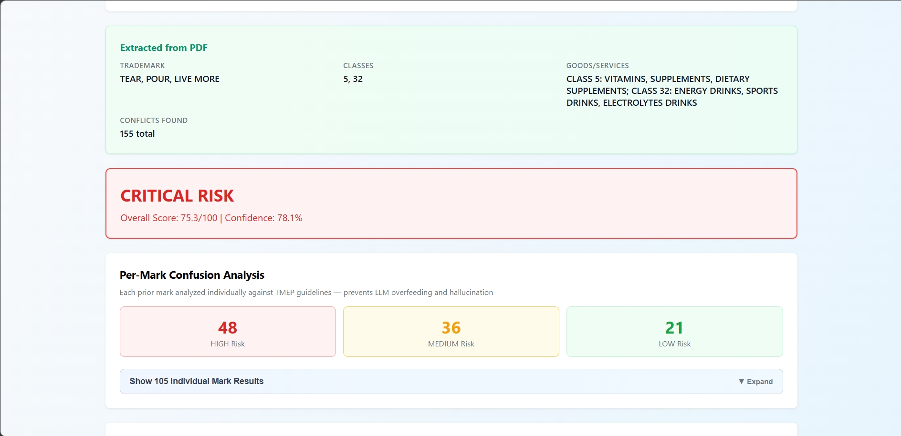
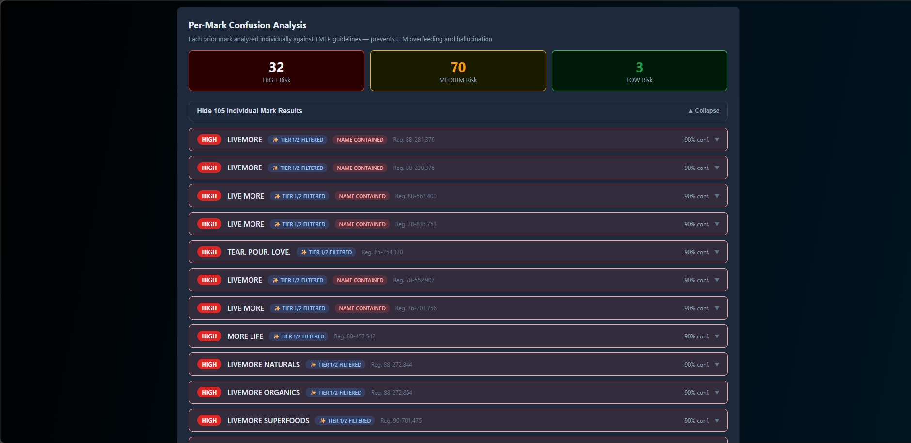
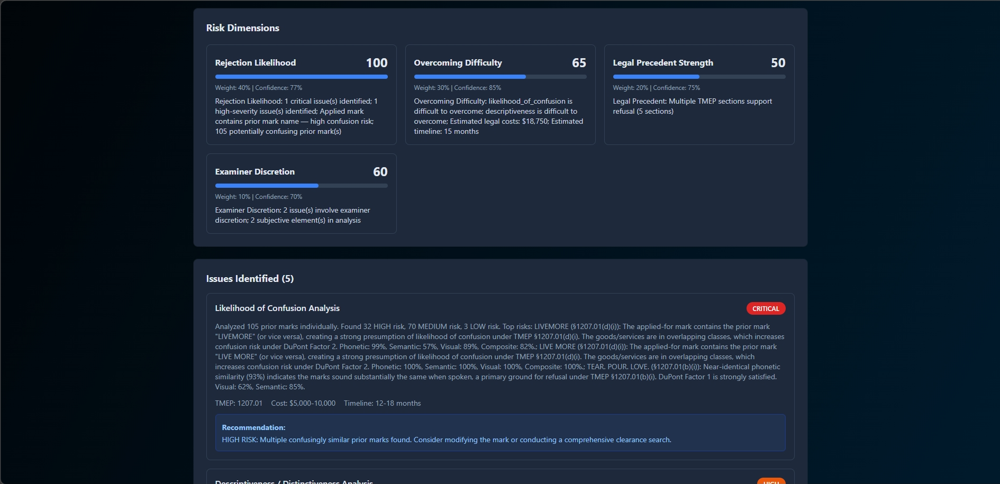
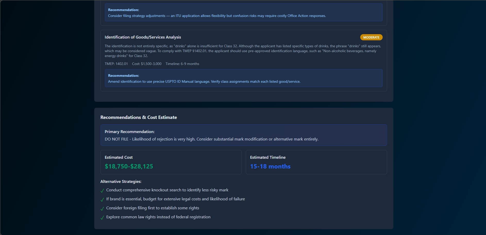

# Trademark Risk Assessment System

> AI-powered trademark risk analysis with **bulletproof anti-hallucination architecture** — designed specifically to provide reliable, source-verified legal insights without LLM fabrications.

## Why This Architecture?

Legal tools cannot tolerate AI hallucinations. Most AI tools attempt to feed hundreds of prior trademarks and thousands of words of legal code into an LLM all at once, leading to "context overfeeding" and severe hallucinations where the AI mixes up facts or invents legal rules.

This system solves this by using a **Focused Per-Mark Analysis Strategy**:
- Each prior mark is analyzed **individually** against the applied mark.
- The LLM is provided with **static, hardcoded legal (TMEP) sections**, completely removing retrieval errors.
- Context is strictly capped at ~200-500 tokens per call.
- Mathematical risk scoring is handled entirely by Python, not the LLM. 

By strictly isolating the LLM's role to generating reasoning text based on tiny, perfectly accurate context windows, the system achieves near-zero hallucination rates.

## Evolution from v1.0 (RAG) to v2.0 (Focused Analysis)

Based on initial testing and architectural feedback, the system underwent a major overhaul to specifically eliminate hallucinations. The previous iteration (v1.0) relied on a standard Retrieval-Augmented Generation (RAG) pipeline:
- **The v1 Problem:** RAG retrieved multiple TMEP sections via FAISS and passed them to the LLM alongside 120+ prior marks at once. This "context overfeeding" (~5000+ tokens) caused the LLM to cross-contaminate facts between marks and hallucinate non-existent legal rules.
- **The v2 Solution:** RAG was completely removed in favor of a **Deterministic, Per-Mark** architecture. The system now uses 20 hardcoded, pre-verified TMEP sections. The LLM analyzes exactly ONE prior mark per API call, constrained by strict Python-based mathematical scoring frameworks (`risk_framework.py`).


## Screenshots

<div align="center">
  
  
</div>
<br>
<div align="center">
  
  
</div>

## Setup Instructions

### Prerequisites
- **Python 3.10+**
- **Node.js 18+**
- **[Ollama](https://ollama.ai/)** (Required for local LLM inference)

---

### Step 1: Clone the Repository
Open a terminal and clone the source code to your local machine:
```bash
git clone https://github.com/080abhinav/trademark-ai.git
cd trademark-ai
```

---

### Step 2: Start the Local LLM (Ollama)
This system relies on a local LLM to guarantee privacy. You must have Ollama running.
Open a terminal and pull the AI model (this may take a few minutes):
```bash
ollama pull llama3.1:8b
```
Ensure the Ollama service is running in the background:
```bash
ollama serve
```

---

### Step 3: Set up the Python Backend
Open a *new* terminal, navigate to the root of the project, and configure the Python API:

```bash
cd backend

# Create and activate a virtual environment (Recommended)
python -m venv venv
# On Windows: venv\Scripts\activate
# On Mac/Linux: source venv/bin/activate

# Install required packages
pip install fastapi uvicorn requests python-multipart PyPDF2

# Start the API server
python main.py
```
*The backend should now be running at `http://localhost:8000`. You can view the API documentation at `http://localhost:8000/docs`.*

---

### Step 4: Set up the React Frontend
Open a *third* terminal, navigate to the root of the project, and start the UI:

```bash
cd frontend

# Install Node modules dependencies
npm install

# Start the development server
npm run dev
```
*The frontend will open in your browser automatically, or you can visit `http://localhost:5173`.*

---

### Step 5: Run Automated Tests
To verify the system's anti-hallucination logic is working correctly:
```bash
cd backend
python test_system.py
```


## Usage

### Option 1: Manual Input
Enter trademark name, goods/services, classes, and known prior marks.

### Option 2: PDF Upload
Upload a CompuMark or USPTO trademark search report (PDF). The system parses the document, extracts prior marks, and analyzes each one individually.

## Architecture

See [docs/ARCHITECTURE.md](docs/ARCHITECTURE.md) for detailed system design.

**Key innovation**: Each prior mark is analyzed independently against focused TMEP guidance, preventing the LLM overfeeding that caused hallucination in v1.0.

## Risk Categorization

See [docs/methodology.md](docs/methodology.md) for the complete risk categorization framework.

**Risk Levels**: CRITICAL → HIGH → MODERATE → LOW → MINIMAL
**Confidence Scoring**: 0-100% with human review triggers below 60%

## Project Structure

```
backend/
  main.py              # FastAPI server (REST API)
  tmep_knowledge.py    # 20 hardcoded TMEP sections
  focused_analyzer.py  # Per-mark analysis (anti-hallucination)
  risk_framework.py    # Multi-dimensional risk scoring
  document_parser.py   # PDF parsing (CompuMark, TESS)
  test_system.py       # System validation tests

frontend/
  src/App.jsx          # React UI with per-mark breakdown
  src/index.css        # Styles

docs/
  ARCHITECTURE.md      # System architecture
  methodology.md       # Risk categorization framework
  RISK_ASSESSMENT_REPORT.md  # Sample analysis report
```

## The 6 Layers of Anti-Hallucination Defense

1. **Pre-loaded Knowledge Base (Static)**: The LLM is never asked to recall law from its weights. 20 highly relevant TMEP sections are hardcoded into the system and injected directly into the prompt.
2. **Per-Mark Isolation**: Prior marks are analyzed individually (one per LLM call) rather than collectively. This strictly prevents cross-contamination and "overfeeding" the context window.
3. **Deterministic Scoring & Overrides**: The LLM only generates reasoning text. Risk scores and timelines are calculated by deterministic Python code (`risk_framework.py`). Critical risks (like exact name matches) and Fanciful marks (no English words) trigger deterministic overrides that bypass LLM judgment entirely.
4. **Fanciful Mark Detection**: A pre-check scans marks against a dictionary of 150+ common English words. Marks with no recognizable words are automatically classified as Fanciful (LOW risk), entirely preventing the LLM from hallucinating meaningless vitality/energy concepts for random strings. 
5. **Classification-Risk Consistency Checks**: The system parses the LLM's structured output and checks for logical contradictions. If the LLM classifies a mark as `SUGGESTIVE` but assigns a `HIGH` risk, the system overrides the risk to `LOW` and lowers confidence to flag it for human review.
6. **Citation Validation Regex**: Before reasoning text is displayed, an automated regex scanner identifies any TMEP sections the LLM cited (e.g., `§ 1209.04(b)`). It checks these against the known 20 sections. Any hallucinated sections append an automated `[⚠️ WARNING]` to the reasoning text.
